# Running Nano Bash Network for Raft

I already have the `BDLS-bft/fabric` repository and `hyperledger/fabric-samples` repository side by side installed. 
The `BDLS-bft/fabric` repository (doesn't contain the smartbft code). This is running nano-bash with `raft`. 

## Steps

1. I changed the `fabric-samples/config/core.yaml` file and placed this replacing lines (602-606) [`externalBuilders`] option:

```yaml
externalBuilders:
       - name: ccaas_builder
         path: /Users/saditya/go/src/github.com/sadityakumar9211/fabric-samples/builders/ccaas
         propagateEnvironment:
           - CHAINCODE_AS_A_SERVICE_BUILDER_CONFIG
```

2. Now I `cd` into the `fabric-samples/test-network-nano-bash` directory to start the each components separately.

- Generate the artifacts using `./generate_artifacts.sh`. Since I will be using `etcdraft` which is not a BFT consensus (it's crash fault tolerant) I will not using the `BFT` argument with the above command. So, the orderer will start for `etcdraft` consensus algorithm.

- No errors encountered for this. 
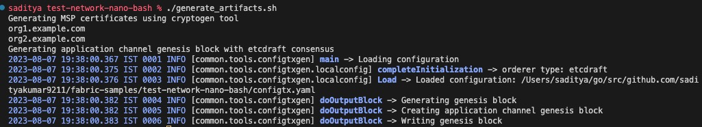

3. In the three orderer terminal, I run `orderer1.sh`. As mentioned in the `Deepto's` notes, I didn't get any error while running the first orderer. Instead I got something unusual (the orderer perhaps is using the configuration for `kafka`, don't know why)??
> This is a doubt: Why getting Kafka configurations while running `etcdraft`?

Here is the logs:

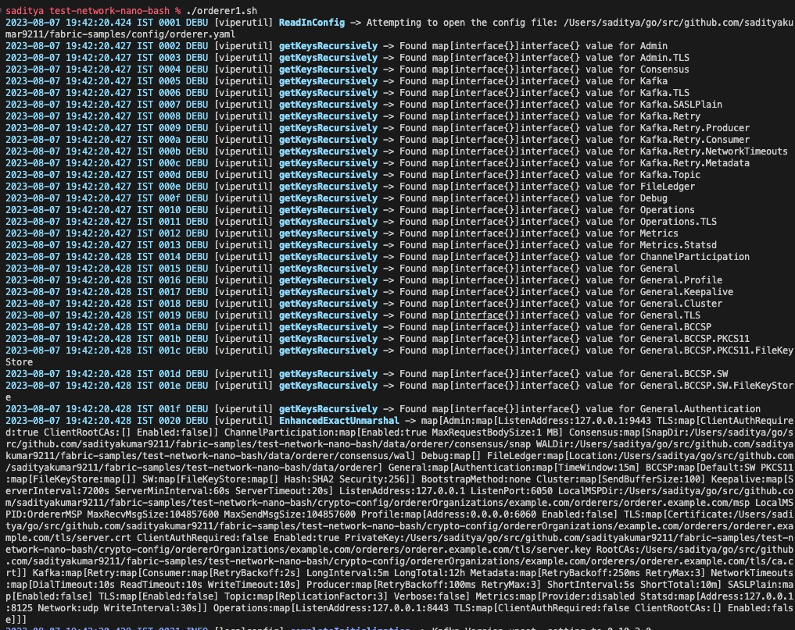
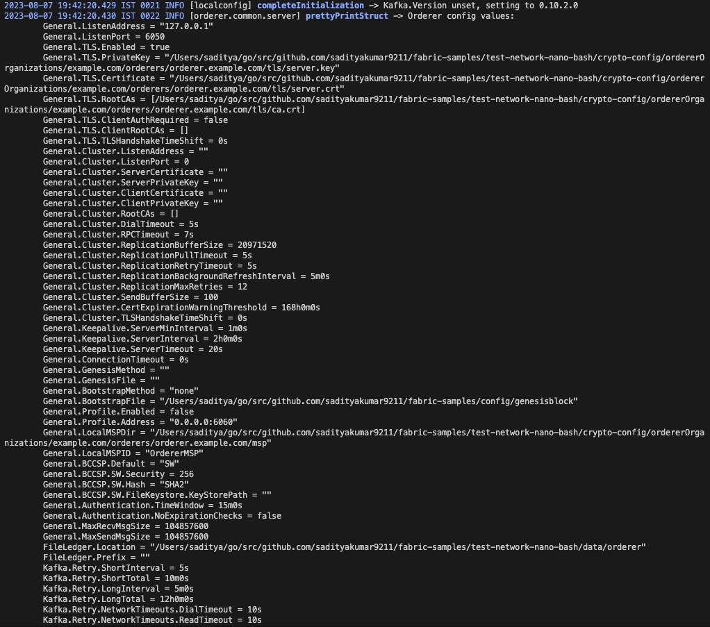

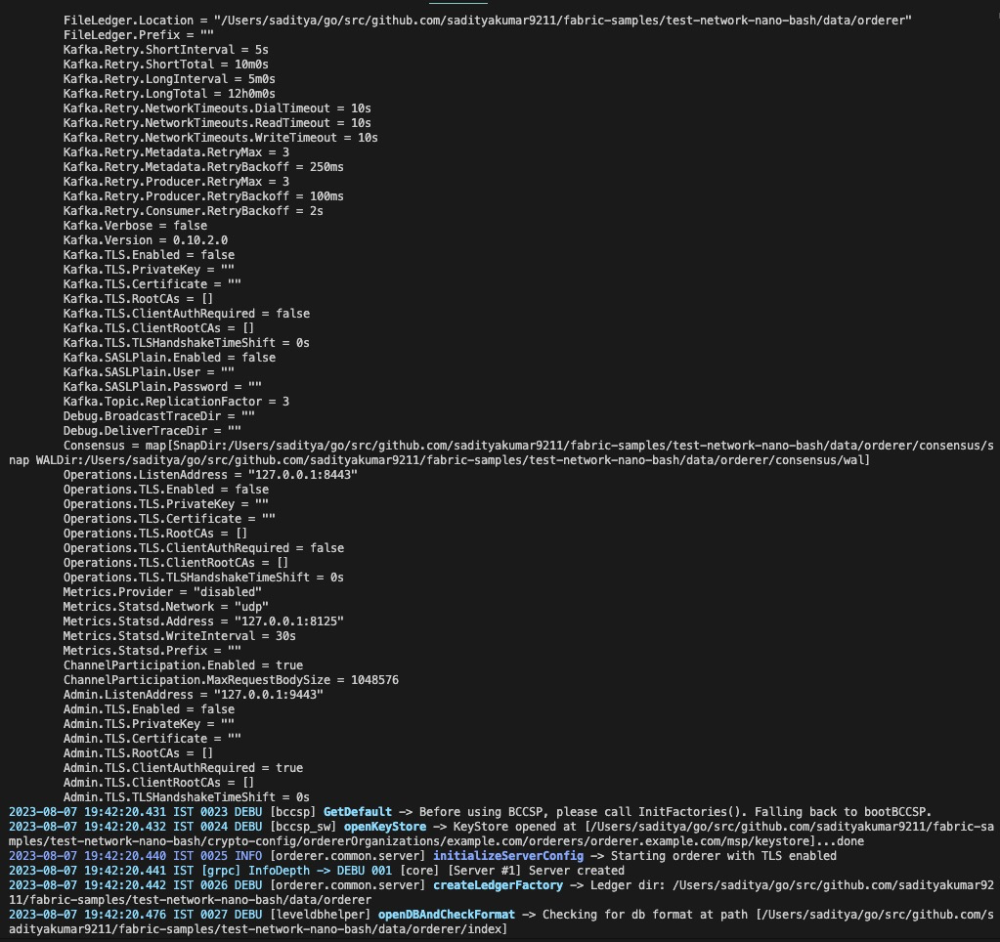
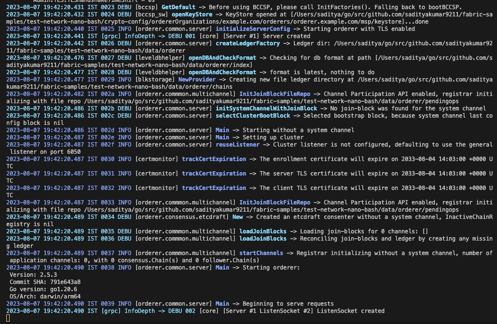

I am getting different results maybe because I am using the `BDLS-bft/fabric` repository for running the nano bash network. I think because my orderer is starting with `etcdraft` consensus algorithm. But, deepto's consenter is starting with `something wal?`


#### Deepto's logs
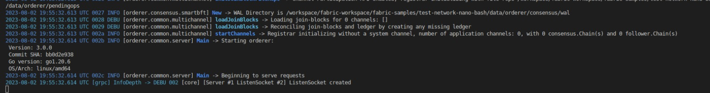
#### My logs
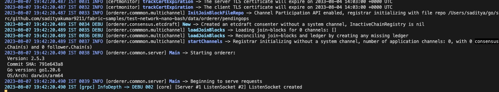

4. Raft/Kafka
- Continuing without commenting out the `kafka` option. 
- Continuing with the raft. will come back and experiment with commenting the `kafka` option.

Now running the second orderer
```bash
./orderer2.sh
```
Got similar output to the command `./orderer1.sh`.


Now running the third orderer
```bash
./orderer3.sh
```
Got similar output to the command `./orderer1.sh`.

> Only running three consenter as etcdraft is not bft and just cft.

3. Now running the peers
- peer1 started
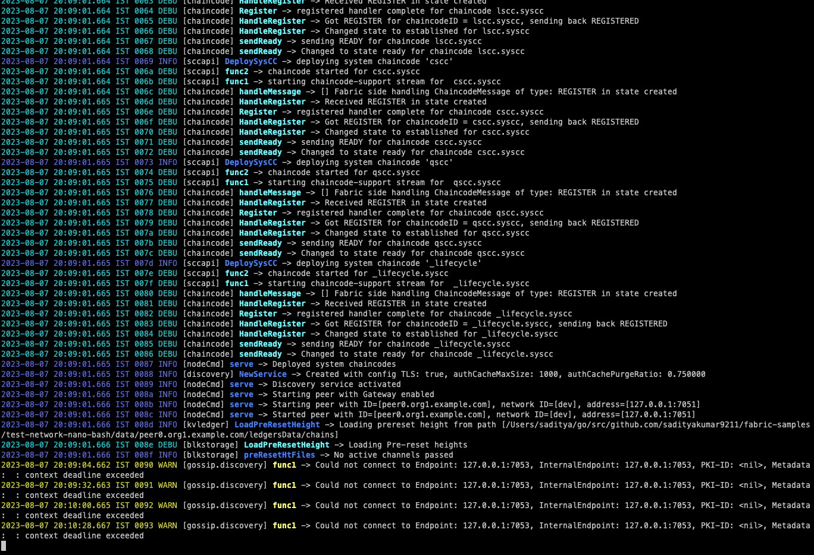
- peer1 and peer2 tls handshake and gossip log
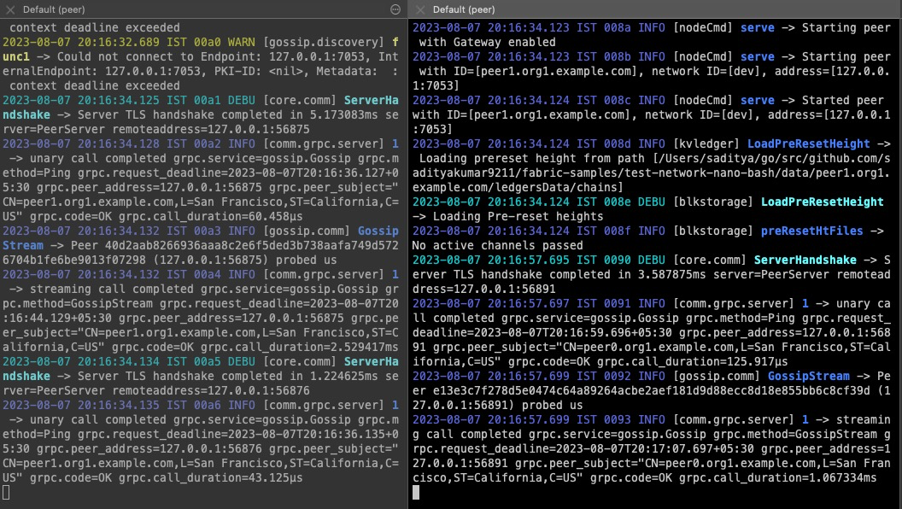
- peer3 and peer4 tls handshake and gossip log
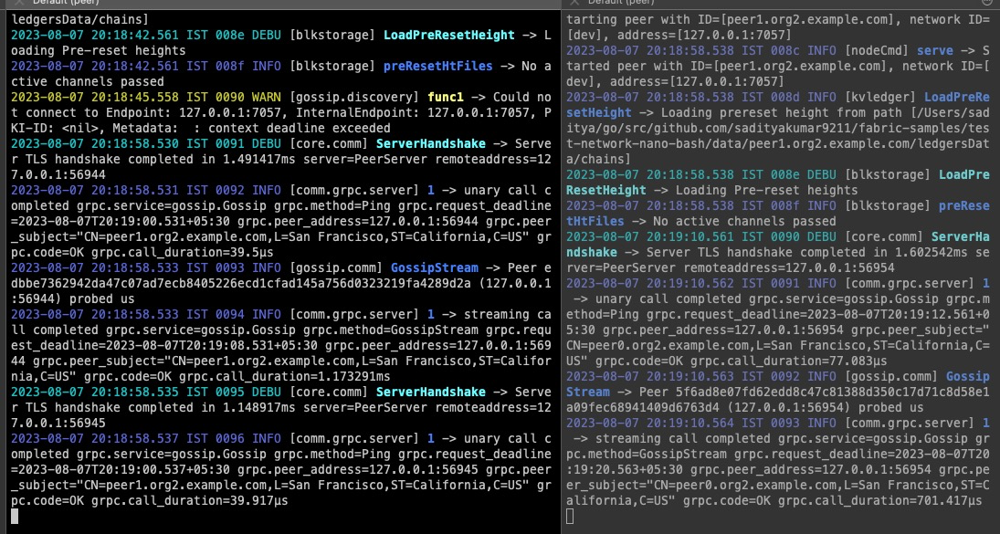

4. Joining the Orderers
`./join_orderers.sh`
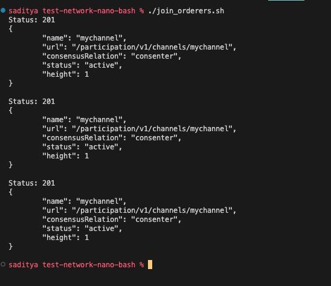
This creates a channel and makes the 4 orderers join it, in the orderer logs, we can observe the channel creation and the subsequent heartbeat messages.

I see orderer1 and 3 sending the messages and orderer2 receiving them. 
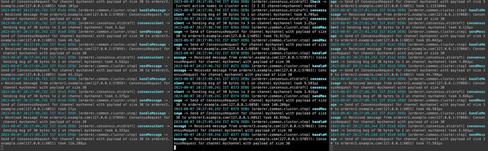

### Joining peers the channel
In the four peer admin terminals, run `source peer1admin.sh && ./join_channel.sh`, `source peer2admin.sh && ./join_channel.sh`, `source peer3admin.sh && ./join_channel.sh`, `source peer4admin.sh && ./join_channel.sh `respectively. Now the peers join the channel

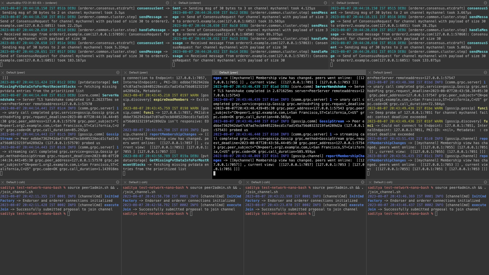

This is running...

