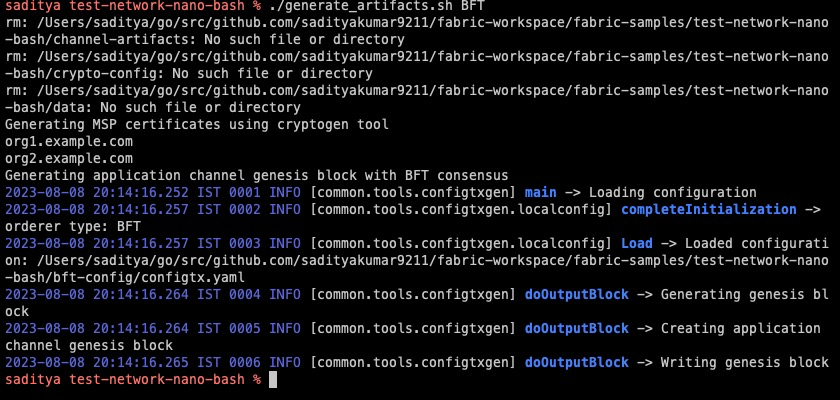
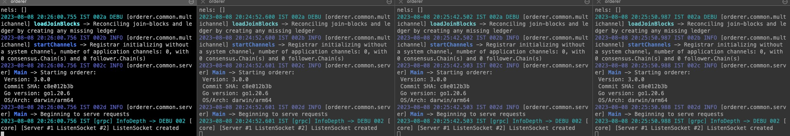
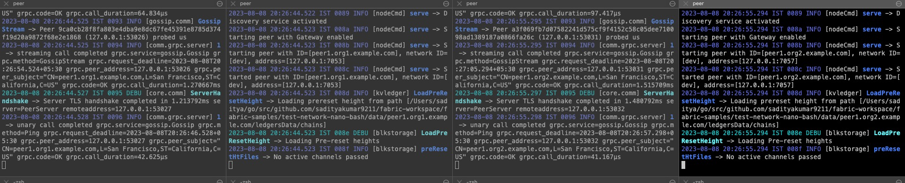
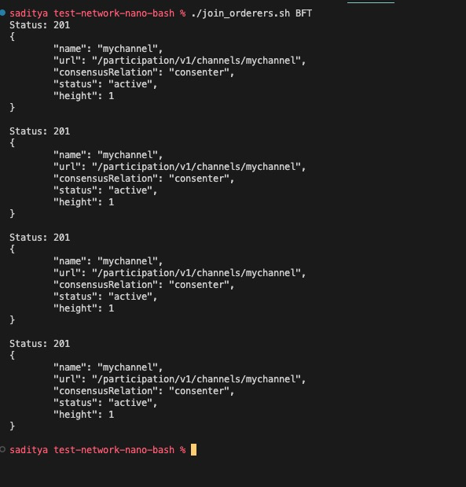
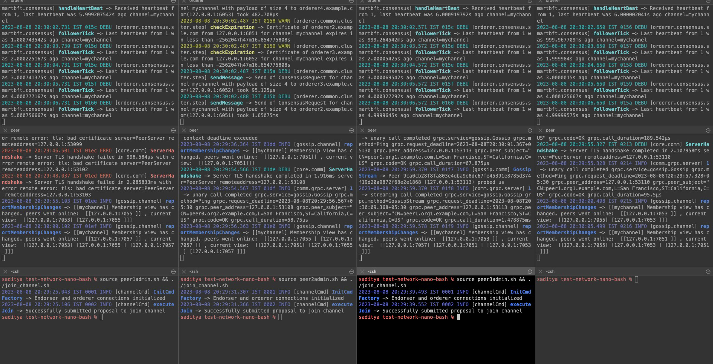

# Running smartbft with nanobash

## Steps
1. Create a separate directory `fabric-workflow`. Clone the `BDLS-bft/bdls-fabric` repository containing the `smart-bft` code. Rename the repository name to `fabric` using `mv bdls-fabric fabric`

2. Get the installation script - `curl -sSLO https://raw.githubusercontent.com/hyperledger/fabric/main/scripts/install-fabric.sh && chmod +x install-fabric.sh`  and run the command `./install-fabric.sh` 
This clones the `hyperledger/fabric-samples` repository and downloads fabric binaries. We can either directly use these binaries or compile fabric -  [docs](https://hyperledger-fabric.readthedocs.io/en/latest/dev-setup/build.html) and use the binaries from there. 

- If there are no fabřic binaries, then it will use the binaries downloaded inside the ,`fabric-samples/bin`. 

3. To run chaincode as a service, we configure the `peer` to use the `ccaas` external builder downloaded with the binaries above. The path specified in the default config file is only valid within the peer container which we won't be using. Editing the `fabric-samples/config/core.yaml` file and modifying the `externalBuilders` field to point to the correct path. The configuration should look something like the following:
```yaml
externalBuilders:
       - name: ccaas_builder
         path: /Users/saditya/go/src/github.com/sadityakumar9211/fabric-workspace/fabric-samples/builders/ccaas
         propagateEnvironment:
           - CHAINCODE_AS_A_SERVICE_BUILDER_CONFIG
```

4. Starting the network (each component separately)

- In the first `orderer` windows run `./generate_artifacts.sh BFT` to generate crypto material (calls cryptogen) and application channel genesis block and configuration transactions (calls configtxgen). The artifacts will be created in the crypto-config and channel-artifacts directories.
This ran without errors:



- Similarly run the `orderer1.sh`.
Got similary error as Deepto. So commenting out the lines 189-284 in the `fabric-samples/config/orderer.yaml`

With this fix, this starts the first orderer. 

Similarly starting all 4 orderers. 



5. Now starting all the 4 peers.


6. Now running `./join_orderers.sh BFT` to join all the 4 orderers. 



7. Now joining the peers in the channel. In the four peer admin terminals, run source peer1admin.sh && ./join_channel.sh, source peer2admin.sh && ./join_channel.sh, source peer3admin.sh && ./join_channel.sh, source peer4admin.sh && ./join_channel.sh respectively. Now the peers join the channel


8. Making changes and seeing in the orderer log. Added a log in the `fabric/orderer/common/server/main.go`> `main()`. Build the orderer using `make orderer`. Rerun one of the orderer(restart). Added logs visible in the console.
