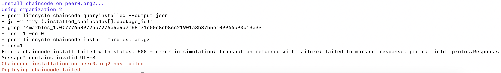

# Deploying chaincode on test-network and benchmarking using Caliper

### Platform: Fabric - 2.4, MacOS, Arm 64, Docker - 20.10.8

### Create Directory for fabric-samples and caliper-benchmarks

```
mkdir fabric-benchmarks
cd fabric-benchmarks
```

### Install fabric-samples and fabric SDK

```
curl -sSLO https://raw.githubusercontent.com/hyperledger/fabric/main/scripts/install-fabric.sh && chmod +x install-fabric.sh
./install-fabric.sh --fabric-version 2.4.0
```

### Install caliper-benchmarks and caliper-cli tool

```
git clone https://github.com/hyperledger/caliper-benchmarks
cd caliper-benchmarks
npm install --only=prod @hyperledger/caliper-cli
npx caliper bind --caliper-bind-sut fabric:2.4
```

### Bind caliper-benchmarks with the Fabric SDK

Run these commands in caliper-benchmarks

```
npx caliper bind --caliper-bind-sut fabric:2.4
```

### Bring up the test-network

Set the envoronment variables for Org1 and Org2

```
echo Change Directory to the fabric-samples/test-network/
cd ~/go/src/github.com/hyperledger/fabric-samples/test-network/
# Environment variables for Org1
echo setting Environment variables for Org1
export CORE_PEER_TLS_ENABLED=true
export CORE_PEER_LOCALMSPID="Org1MSP"
export CORE_PEER_TLS_ROOTCERT_FILE=${PWD}/organizations/peerOrganizations/org1.example.com/peers/peer0.org1.example.com/tls/ca.crt
export CORE_PEER_MSPCONFIGPATH=${PWD}/organizations/peerOrganizations/org1.example.com/users/Admin@org1.example.com/msp
export CORE_PEER_ADDRESS=localhost:7051

# Environment variables for Org2
echo setting Environment variables for Org2
export CORE_PEER_TLS_ENABLED=true
export CORE_PEER_LOCALMSPID="Org2MSP"
export CORE_PEER_TLS_ROOTCERT_FILE=${PWD}/organizations/peerOrganizations/org2.example.com/peers/peer0.org2.example.com/tls/ca.crt
export CORE_PEER_MSPCONFIGPATH=${PWD}/organizations/peerOrganizations/org2.example.com/users/Admin@org2.example.com/msp
export CORE_PEER_ADDRESS=localhost:9051

```

### Start the network and create the channel

For basic chaincode execution you can use the default level db provided by Hyperledger using the below code

```
./network.sh up createChannel
```

For rich queries you can use couch db.

```
./network.sh up createChannel -s couchdb
```

### Deploy chaincode

We will be deploying the fabcar chaincode, this doesn't require rich queries, thus we won't be needing couch db. The fabcar chaincode is available in Go, Java and Javascript. We will be using the Go chaincode.
We have run the command in the test-network directory.

```
./network.sh deployCC -ccn fabcar -ccp ../../caliper-benchmarks/src/fabric/samples/fabcar/go -ccl go
```

### Benchmark Execution

Run this command in the caliper-benchmarks driectory

```
npx caliper launch manager --caliper-workspace ./ --caliper-networkconfig networks/fabric/test-network.yaml --caliper-benchconfig benchmarks/samples/fabric/fabcar/config.yaml --caliper-flow-only-test --caliper-fabric-gateway-enabled
```

### Troubleshooting common issues

Most of the issues can be resolved by bringing down the network using the below command

```
./network.sh down
```

Sometimes the chaincode might not be deployed in one or more of the peers. In this case chaincode has to cleaned and vendorized using the below go commands.


```
go mod tidy
go mod vendor
```

## References

- https://github.com/hyperledger/caliper-benchmarks/blob/main/networks/fabric/README.md#fabcar

- https://hyperledger-fabric.readthedocs.io/en/latest/test_network.html
