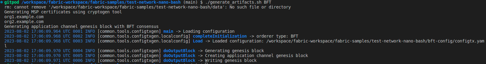
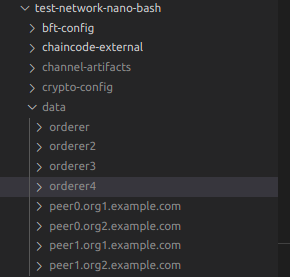

# Test network - Nano bash

Test network Nano bash provides a set of minimal bash scripts to run a Fabric network on your local machine.
clone fabric, check out main for bft

## Steps

1. Get installation script - `curl -sSLO https://raw.githubusercontent.com/hyperledger/fabric/main/scripts/install-fabric.sh && chmod +x install-fabric.sh`
2. Run `./install-fabric.sh samples binary`. This clones the samples repo and downloads binaries in `fabric-samples/bin` (upto us to use these binaries in the following steps or compile fabric from scratch and use binaries from there.  
    Note : If we look at the `fabric-samples/test-network-nano-bash/orderer1.sh` file or the other orderer.sh files, we see that it expects binaries from a fabric build and if not found, uses the sample binaries:  
    ```
    # look for binaries in local dev environment /build/bin directory and then in local samples /bin directory
    export PATH="${PWD}"/../../fabric/build/bin:"${PWD}"/../bin:"$PATH"
    ```
3. If we want to run Nano Bash with our own Fabric dev setup, we need to compile the fabric source and use binaries from `fabric/bin` instead of `fabric-samples/bin`. Therefore the Fabric repo must be cloned alongside Fabric Samples as well.
   `git clone https://github.com/hyperledger/fabric`in the same root folder where we ran the install script
   The folder structure should be:

   ```
   |----
       |--- fabric-samples
       |--- fabric
   ```

   To test SmartBFT, we must checkout to the main branch of Fabric, not 2.5 or someother version, without SmartBFT. We build the binaries of Fabric with :

   ```
   cd fabric
   git checkout main  
   make configtxgen configtxlator cryptogen orderer peer osnadmin
   ```

   Once the build succeeds, we should see the following output, along with the binaries in `fabric/build/bin`:

   
4. To run the chaincode as a service, we need to configure the peer to use the `ccaas` external builder downloaded with the binaries above. The path specified by default in s`fabric-samples/config/core.yaml` file is only valid within the peer container which we won't be using. Edit it and modify the `externalBuilders` field to point to the correct path (location to `fabric-samples/builders/ccaas`):

   ```
   externalBuilders:
       - name: ccaas_builder
           path: /workspace/fabric-workspace/fabric-samples/builders/ccaas  //Replace with path in your system
           propagateEnvironment:
           - CHAINCODE_AS_A_SERVICE_BUILDER_CONFIG
   ```
5. Starting the network (each component separately)

   * Open terminal windows for 3 ordering nodes or 4 if running BFT Consensus, 4 peer nodes, and 4 peer admins
   * `cd fabric-samples/test-network-nano-bash` in each terminal
   * In the first orderer terminal, run `./generate_artifacts.sh BFT` to generate crypto material (calls cryptogen) and application channel genesis block and configuration transactions (calls configtxgen). The artifacts will be created in the crypto-config and channel-artifacts directories.

     * `fabric-samples/test-network-nano-bash/bft-config/configtx.yaml` This is the config file used
     * ~~Getting error~~ This is solved now
       
     * ~~I think the problem is the install command fetches version 2.5's binary, need to figure out how to get it from the main branch~~ This was the issue
     * When it succeeds, we should see:  
       
     * The artifacts will be created in the `test-network-nano-bash/crypto-config` and `test-network-nano-bash/channel-artifacts` directories:  
        
     * In the three orderer terminals, run `./orderer1.sh`, `./orderer2.sh`,`./orderer3.sh` respectively. If you are running BFT consensus then run `./orderer4.sh` in the fourth orderer terminal also. Config is picked  from `fabric-samples/config/orderer.yaml`
        * I got this error, on running `./orderer1.sh`. (Ahmed had gotten this as well):
            
        * Fix : in the `fabric-samples/config/orderer.yaml` file, comment out the entire section for Kafka (Lines 189-284). TODO : Ahmed suggested using orderer.yaml from `fabric/sampleconfig/orderer.yaml`, I noticed a few other differences apart from Kafka not being there, clarify if these are important - 
            * fabric-samples/config.orderer.yaml uses `BootstrapMethod: file` and `ChannelParticipation` is disabled
            * fabric/sampleconfig/orderer.yaml uses `BootstrapMethod: none` and `ChannelParticipation` is enabled
        * With the fix,`./orderer1.sh` starts the first orderer:
            
        * Same output for the remainging 3 orderers.  
        * Now we can see the orderer data in `fabric-samples/test-network-nano-bash/data`:  
            

      * In the four peer terminals, run `./peer1.sh`,`./peer2.sh`,`./peer3.sh`,`./peer4.sh`
        * Output for `./peer1.sh`:  
            
        * After we run `./peer2.sh`, we can observe the handshake and gossip in peer 1 and peer 2's logs: (Peer1 on left, Peer2 on right)
            
        * Run `./peer3.sh` and `./peer4.sh`, since they're also peers, we observe the same (Peer3 on left, Peer4 on right):
            
        * In the peer sh files, `CORE_PEER_ADDRESS` is the port the peer runs on and `CORE_PEER_GOSSIP_BOOTSTRAP` is the other peer in the same org with which the core peer gossips. For example, here we can see that peer1 and peer2 are configured to gossip with each other:  
            
        * We also see the peer data in `fabric-samples/test-network-nano-bash/data`  
            
      * Open a different terminal and run ./join_orderers.sh. If you are running BFT Consensus then run `./join_orderers.sh BFT` instead.  
            
         This creates a channel and makes the 4 orderers join it, in the orderer logs, we can observe the channel creation and the subsequent heartbeat messages.  
         I see Orderer 1 sending messages, and 2,3,4 receiving them: (Ord 1 on left, Ord2 on right)
            
      * In the four peer admin terminals, run `source peer1admin.sh && ./join_channel.sh`, `source peer2admin.sh && ./join_channel.sh`, `source peer3admin.sh && ./join_channel.sh`, `source peer4admin.sh && ./join_channel.sh` respectively. Now the peers join the channel  
 
          
          * Peer 1:  

          
          * Only when I ran all 4, it seemed to work, when I had ran just 1 and 2, there seemed to be some errors
     
